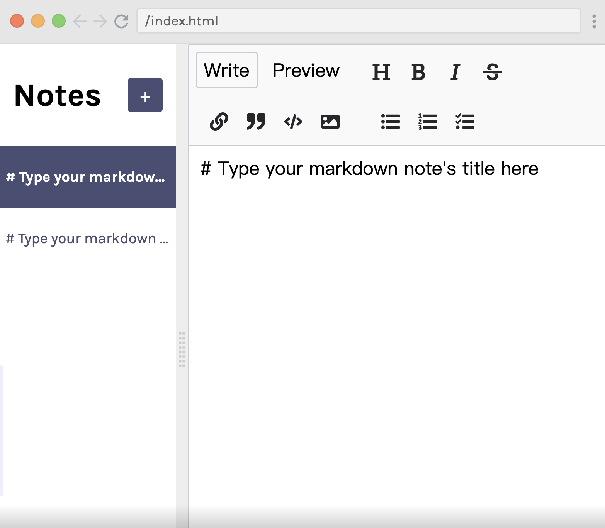

# Notes App Clone 📝

A modern, feature-rich notes application built with React and Vite. This project provides a clean, intuitive interface for creating, editing, and managing markdown notes with real-time preview capabilities.



## ✨ Features

- **📝 Markdown Editor**: Write notes in markdown with live preview
- **🔄 Real-time Updates**: Instant saving and updating of notes
- **💾 Local Storage**: Persistent storage using browser's localStorage
- **🎨 Split View**: Resizable sidebar and editor panels
- **🗑️ Delete Notes**: Easy note management with delete functionality
- **📱 Responsive Design**: Works seamlessly across different screen sizes
- **🚀 Fast Performance**: Built with Vite for optimal development and build performance

## 🛠️ Technologies Used

- **React 17** - Frontend library
- **Vite** - Build tool and development server
- **react-mde** - Markdown editor component
- **react-split** - Resizable split panes
- **Showdown** - Markdown to HTML converter
- **nanoid** - Unique ID generation
- **CSS3** - Styling and responsive design

## 🚀 Getting Started

### Prerequisites

Make sure you have Node.js installed on your machine (version 14 or higher recommended).

### Installation

1. Clone the repository:
```bash
git clone <repository-url>
cd Notes-App-Clone
```

2. Install dependencies:
```bash
npm install
```

3. Start the development server:
```bash
npm run dev
```

4. Open your browser and navigate to `http://localhost:5173` (or the port shown in your terminal)

### Build for Production

```bash
npm run build
```

### Preview Production Build

```bash
npm run preview
```

## 📖 How to Use

1. **Create a Note**: Click the "+" button in the sidebar to create a new note
2. **Edit Notes**: Click on any note in the sidebar to start editing
3. **Markdown Support**: Use markdown syntax for formatting (headers, lists, bold, italic, etc.)
4. **Live Preview**: Switch between "Write" and "Preview" tabs to see your formatted content
5. **Delete Notes**: Click the trash icon next to any note to delete it
6. **Auto-save**: Your notes are automatically saved to localStorage

## 🏗️ Project Structure

```
Notes-App-Clone/
├── public/
│   ├── vite.svg
│   └── WeChat47e9005758b849cd618646f2147b80f8.png
├── src/
│   ├── components/
│   │   ├── Editor.jsx      # Markdown editor component
│   │   └── Sidebar.jsx     # Notes list sidebar
│   ├── App.css            # Main application styles
│   ├── App.jsx            # Main application component
│   ├── data.js            # Sample data
│   └── main.jsx           # Application entry point
├── index.html
├── package.json
├── vite.config.js
└── README.md
```

## 🔧 Key Components

### App.jsx
Main application component that manages:
- Notes state and localStorage persistence
- Current note selection
- CRUD operations (Create, Read, Update, Delete)

### Editor.jsx
Markdown editor component featuring:
- ReactMDE integration
- Showdown converter for markdown rendering
- Write and preview modes

### Sidebar.jsx
Notes list component with:
- Note selection functionality
- New note creation
- Note deletion with confirmation

## 🎨 Features in Detail

### Markdown Support
The app supports full markdown syntax including:
- Headers (# ## ###)
- **Bold** and *italic* text
- Lists (ordered and unordered)
- Links and images
- Code blocks
- Tables
- Strikethrough text
- Task lists

### Data Persistence
- Notes are automatically saved to browser's localStorage
- No data loss on page refresh or browser restart
- Seamless experience across sessions

### Smart Note Organization
- Recently modified notes appear at the top
- Easy navigation between notes
- Visual indication of currently selected note

## 🤝 Contributing

1. Fork the project
2. Create your feature branch (`git checkout -b feature/AmazingFeature`)
3. Commit your changes (`git commit -m 'Add some AmazingFeature'`)
4. Push to the branch (`git push origin feature/AmazingFeature`)
5. Open a Pull Request

## 📚 Learning Resources

This project was inspired by the Scrimba React course:
- **Course URL**: https://scrimba.com/learn/learnreact/notes-app-delete-note-co0764af7bcc2738e9be81e9a

## 📄 License

This project is open source and available under the [MIT License](LICENSE).

## 🙏 Acknowledgments

- Scrimba for the excellent React tutorial
- The React community for amazing tools and libraries
- Contributors and maintainers of the dependencies used in this project

---

**Happy note-taking! 📝✨**
